# flowline

Flowline is a workflow system for schedule

## Features

- Workflow base DAG
- RABC
- logs
- custom runtime

## Architecture

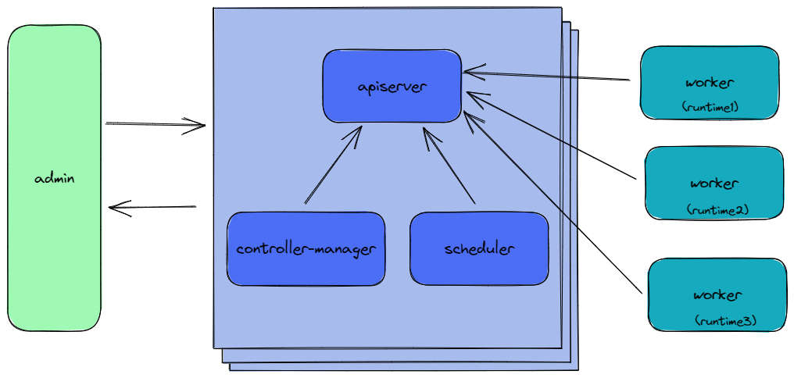 

## Applications used

- etcd

## Requirements

This project requires Go 1.18 or newer

## Installation

1. Install etcd

2. Import Configuration to etcd

3. Set Environment

4. Build binary

5. Run App binary

## Flowline REST API

[Swagger UI](https://tsundata.github.io/flowline/)

## [Flowline admin](https://github.com/tsundata/flowline-admin)

### dashboard
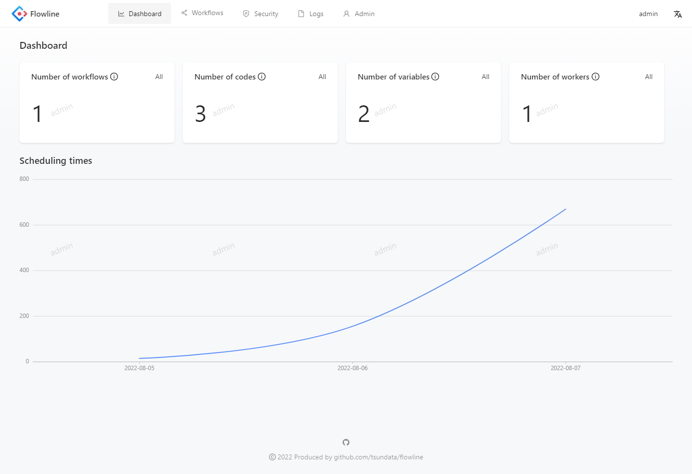

### workflows
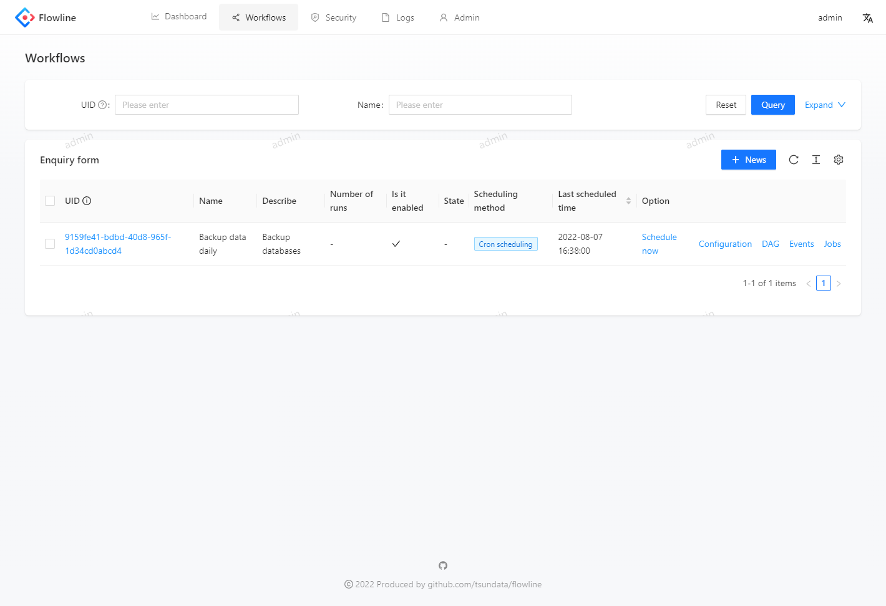

### dag editor
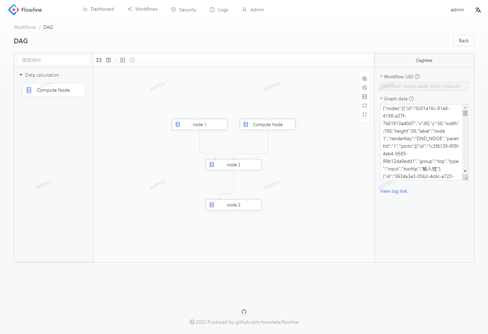

### users
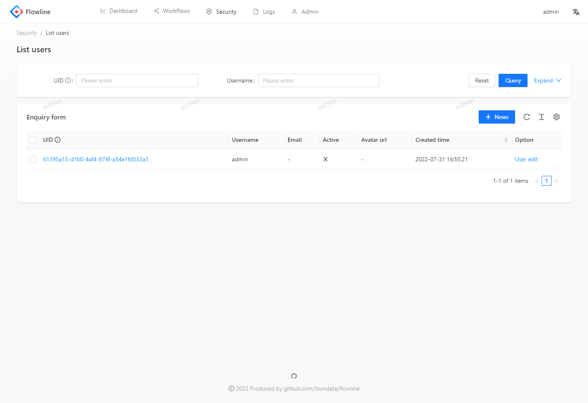

### runs
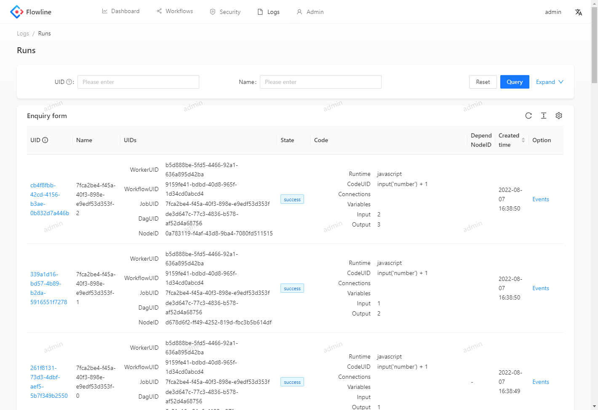

### jobs
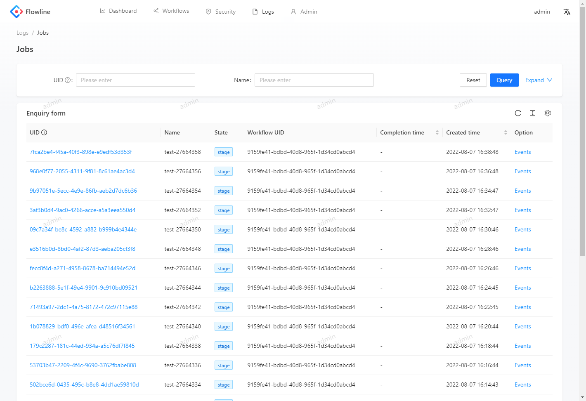

### events
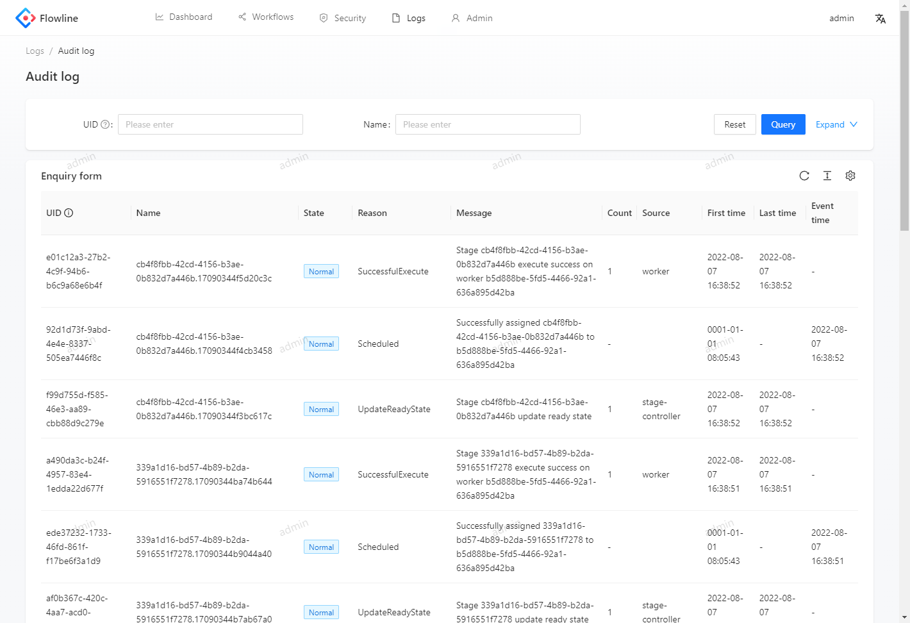

### workers
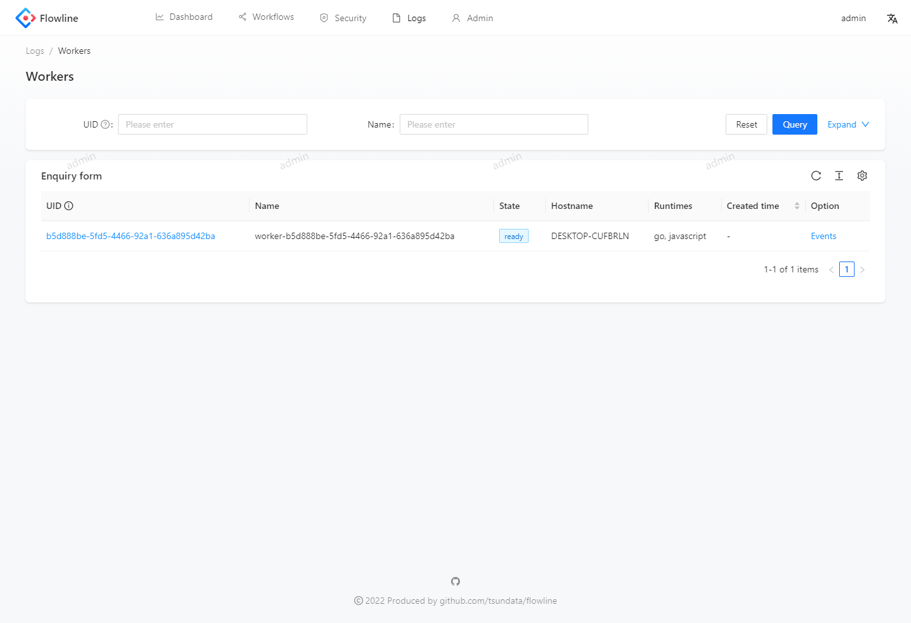

### codes
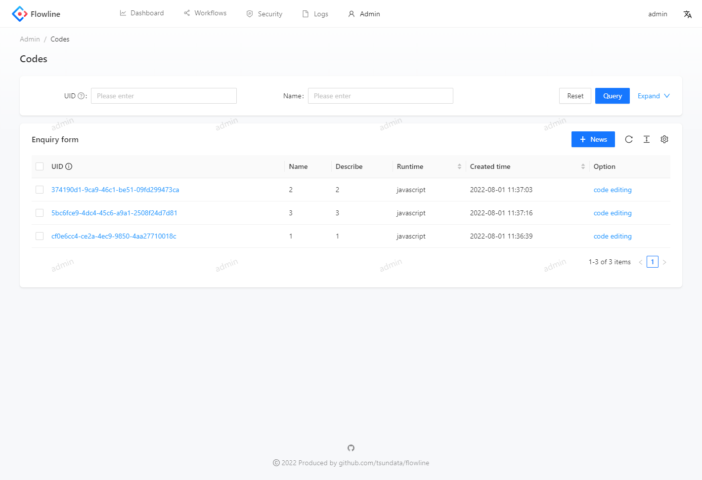

### variables
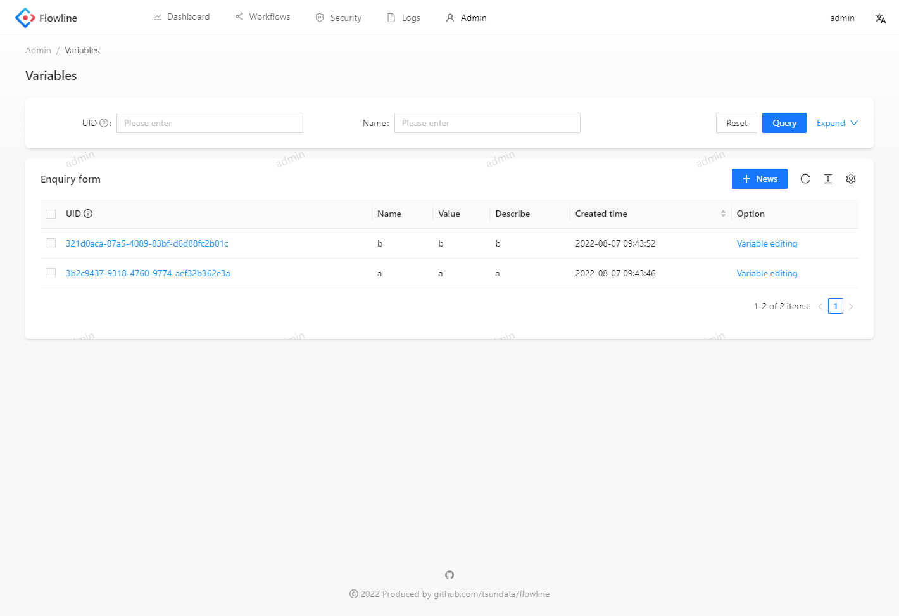

### connections
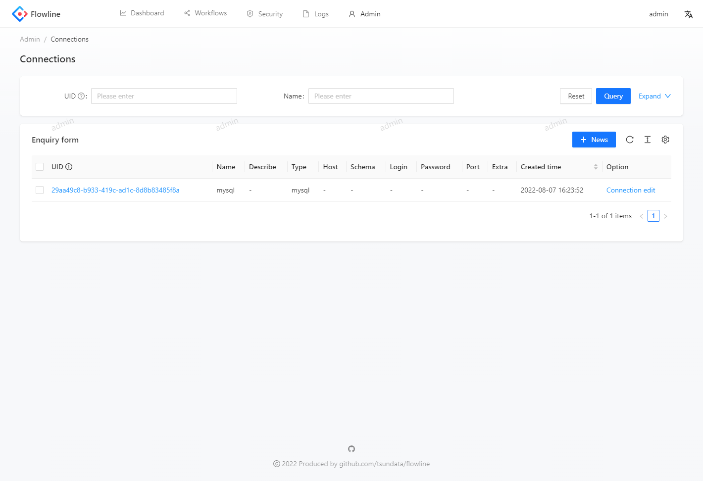

## Reference

[kubernetes](https://github.com/kubernetes/kubernetes)

## License

flowline is licensed under the [MIT license](https://opensource.org/licenses/MIT).
